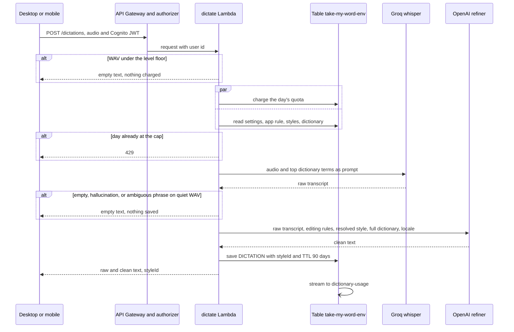

# Dictation: flows

Only flows that deserve a diagram. A CRUD does not.

## Dictation pipeline

Runs on every `POST /dictations`, from desktop on hotkey release or from mobile on button release.

```mermaid
sequenceDiagram
  participant C as Desktop or mobile
  participant G as API Gateway and authorizer
  participant D as dictate Lambda
  participant T as Table take-my-word-env
  participant S as Groq whisper
  participant R as OpenAI refiner
  C->>G: POST /dictations, audio and Cognito JWT
  G->>D: request with user id
  alt WAV under the level floor
    D-->>C: empty text, nothing charged
  end
  par
    D->>T: charge the day's quota
  and
    D->>T: read settings, app rule, styles, dictionary
  end
  alt day already at the cap
    D-->>C: 429
  end
  D->>S: audio and top dictionary terms as prompt
  S-->>D: raw transcript
  alt empty, hallucination, or ambiguous phrase on quiet WAV
    D-->>C: empty text, nothing saved
  end
  D->>R: raw transcript, editing rules, resolved style, full dictionary, locale
  R-->>D: clean text
  D->>T: save DICTATION with styleId and TTL 90 days
  D-->>C: raw and clean text, styleId
  T-)T: stream to dictionary-usage
```
